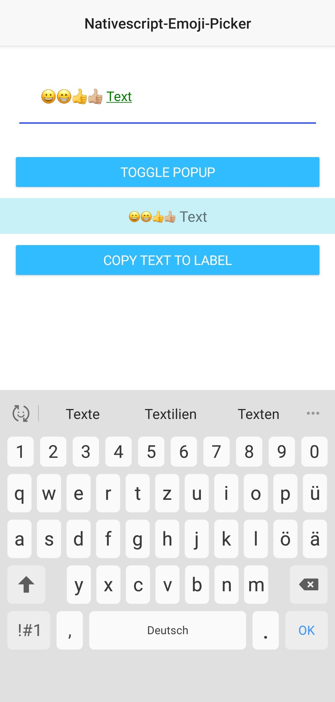
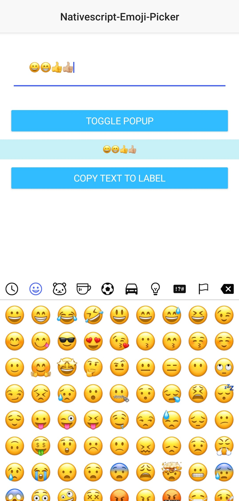

# nativescript-emoji-picker😃

[](https://github.com/hrueger/nativescript-emoji-picker/actions) [](https://github.com/hrueger/nativescript-emoji-picker/blob/master/LICENSE) [](https://github.com/hrueger/nativescript-emoji-picker/graphs/commit-activity)

There are many emoji pickers for angular and the web, but no one for NativeScript?! Let's change this!

## How it looks like
| Keyboard view             |  Emoji picker view |
:-------------------------:|:-------------------------:
|  |  |

As this plugin is currently in developement screenshots will be added later this year.

## Limitation
The emoji picker currently only supports Android. An IOS version is in development. 

## Installation

Install the plugin using `tns plugin add nativescript-emoji-picker`

## Usage 
### How does it work?
This plugin will give you two elements, `EmojiPicker` and `EmojiLabel`. The first one will give you an editable textfield (very similar to the NativeScript TextField) and the second one is a label (similar to NativeScript Label), which will display your emojis in the text correctly.

### NativeScript Core:
Define the namespace
```xml
<Page class="page"
    loaded="pageLoaded"
    navigatingTo="onNavigatingTo" 
    xmlns="http://schemas.nativescript.org/tns.xsd"
    xmlns:ns="nativescript-emoji-picker">
```
Use the plugin:
```xml
<ns:EmojiPicker id="myEmojiPicker"></ns:EmojiPicker>
<ns:EmojiLabel id="myEmojiLabel"></ns:EmojiLabel>
```
On the JS / TS Side you can toggle the keyboard or the popup window of the edit text field like this:
```typescript
const page = frame.topmost().currentPage;
page.getViewById("myEmojiPicker").togglePopup();
```

The `<EmojiPicker>` class extends the `TextField` NativeScript class, which means that all of TextField's properties and methods are supported.
It is the same with `<EmojiLabel>` and the `Label` class.

You can add custom styles by using ids, classes or the tag selector in (s)css:
```css
EmojiLabel {
    background-color: rgba(14, 190, 221, 0.233);
    padding: 10;
    text-align: center;
    font-size: 20;
}

EmojiPicker {
    padding: 30;
    color: green;
    margin: 20;
}
```

For more info and examples check out the demo folder.

### Angular Version:

In your `app.module.ts` include the library like so:
```typescript
import { EmojiPickerModule } from "nativescript-emoji-picker/angular";
```
and add it to the imports array:
```typescript
@NgModule({
    bootstrap:  [
        ...
    ],
    declarations: [
        ...
    ],
    imports: [
        ...
        EmojiPickerModule, // <--- add this here
    ],
    schemas: [
        ...
    ],
})
export class AppModule { }
```

The use it in your .html file:
```html
<EmojiPicker #myEmojiPicker></EmojiPicker>
<EmojiLabel #myEmojiLabel text="Have fun with the nativescript-emoji-picker😃"></EmojiLabel>
```
On the TS Side you can toggle the keyboard or the popup window of the edit text field like this:

```typescript
export class HomeComponent {
    @ViewChild("myEmojiPicker", { static: false }) public myEmojiPicker: EmojiPicker;
    @ViewChild("myEmojiLabel", { static: true }) public myEmojiLabel: EmojiLabel;


    public onButtonTap(): void {
        this.myEmojiPicker.nativeElement.togglePopup();
    }

    public onCopyBtnTap(): void {
        console.log("pressed!");
        this.myEmojiLabel.nativeElement.text = this.myEmojiPicker.nativeElement.text;
    }

}
```


The `<EmojiPicker>` class extends the `TextField` NativeScript class, which means that all of TextField's properties and methods are supported.
It is the same with `<EmojiLabel>` and the `Label` class.

You can add custom styles by using ids, classes or the tag selector in (s)css:
```css
EmojiLabel {
    background-color: rgba(14, 190, 221, 0.233);
    padding: 10;
    text-align: center;
    font-size: 20;
}

EmojiPicker {
    padding: 30;
    color: green;
    margin: 20;
}
```

For more info and examples check out the demo-angular folder.


## License

MIT
