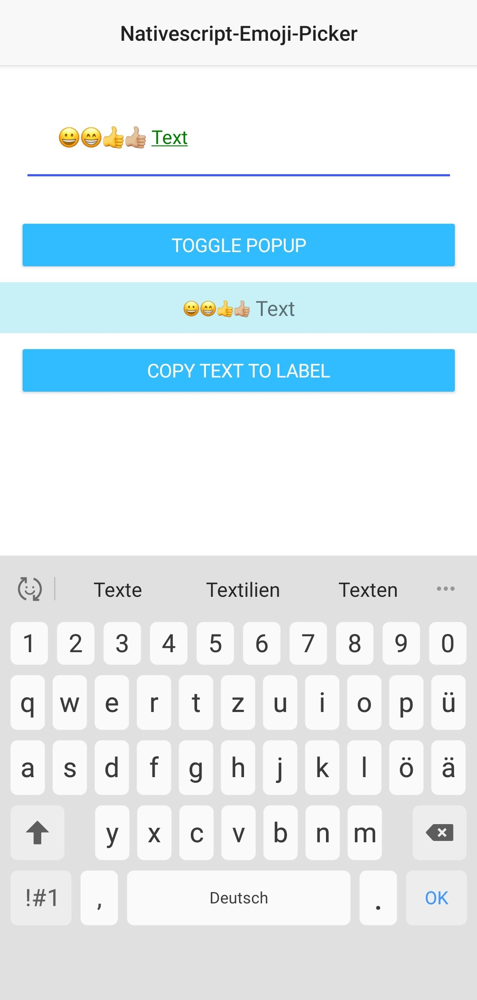
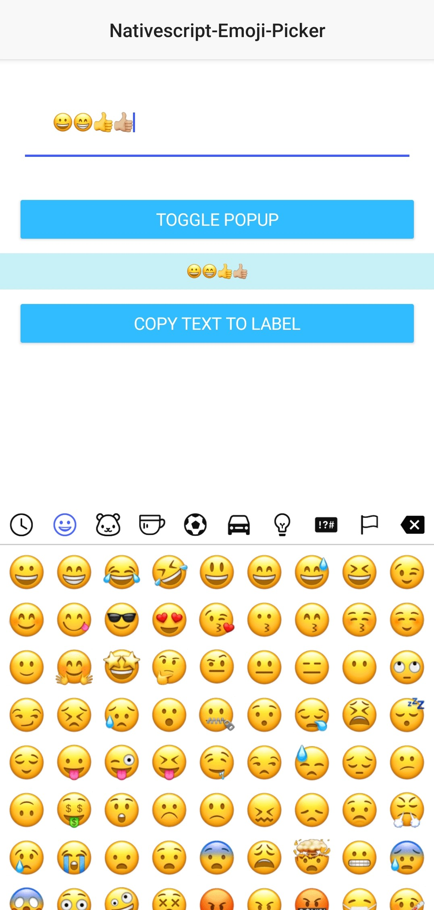

# @schoolsquirrel/emoji-picker😃

[](https://github.com/@SchoolSquirrel/nativescript-plugins/actions) [](https://github.com/@SchoolSquirrel/nativescript-plugins/blob/master/LICENSE) [](https://github.com/@SchoolSquirrel/nativescript-plugins/graphs/commit-activity)

There are many emoji pickers for Angular and the web, but no one for NativeScript?! Let's change this!

## How it looks like

|                     Keyboard view                      |                   Emoji picker view                    |
| :----------------------------------------------------: | :----------------------------------------------------: |
|  |  |

## Limitation

The emoji picker currently only supports Android and NativeScript 7 or higher. In case you need to use an older NativeScript version, have a look at the [`old` branch](https://github.com/SchoolSquirrel/nativescript-plugins/tree/old).

## Installation

Install the plugin using `ns plugin add @schoolsquirrel/emoji-picker`

## Usage

### How does it work?

This plugin will give you two elements, `EmojiPicker` and `EmojiLabel`. The first one will give you an editable textfield (very similar to the NativeScript TextView) and the second one is a label (similar to NativeScript Label), which will display your text with emojis correctly.

### NativeScript Core:

Define the namespace

```xml
<Page class="page"
    loaded="pageLoaded"
    navigatingTo="onNavigatingTo"
    xmlns="http://schemas.nativescript.org/tns.xsd"
    xmlns:ns="@schoolsquirrel/emoji-picker">
```

Use the plugin:

```xml
<ns:EmojiPicker id="myEmojiPicker"></ns:EmojiPicker>
<ns:EmojiLabel id="myEmojiLabel"></ns:EmojiLabel>
```

On the JS / TS Side you can toggle the keyboard or the popup window of the edit text field like this:

```typescript
const page = frame.Frame.topmost().currentPage;
page.getViewById('myEmojiPicker').togglePopup();
```

The `<EmojiPicker>` class extends the `TextField` NativeScript class, which means that all of TextField's properties and methods are supported.
It is the same with `<EmojiLabel>` and the `Label` class.

You can add custom styles by using ids, classes or the tag selector in (s)css:

```css
EmojiLabel {
	background-color: rgba(14, 190, 221, 0.233);
	padding: 10;
	text-align: center;
	font-size: 20;
}

EmojiPicker {
	padding: 30;
	color: green;
	margin: 20;
}
```

For more info and examples check out the [demo](https://github.com/SchoolSquirrel/nativescript-plugins/tree/main/apps/demo/src/plugin-demos) folder.

### Angular Version:

In your `app.module.ts` include the library like so:

```typescript
import { EmojiPickerModule } from '@schoolsquirrel/emoji-picker/angular';
```

and add it to the imports array:

```typescript
@NgModule({
    bootstrap:  [
        ...
    ],
    declarations: [
        ...
    ],
    imports: [
        ...
        EmojiPickerModule, // <--- add this here
    ],
    schemas: [
        ...
    ],
})
export class AppModule { }
```

The use it in your .html file:

```html
<EmojiPicker #myEmojiPicker></EmojiPicker> <EmojiLabel #myEmojiLabel text="Have fun with @schoolsquirrel/emoji-picker"></EmojiLabel>
```

On the TS Side you can toggle the keyboard or the popup window of the edit text field like this:

```typescript
export class HomeComponent {
	@ViewChild('myEmojiPicker', { static: false }) public myEmojiPicker: EmojiPicker;
	@ViewChild('myEmojiLabel', { static: true }) public myEmojiLabel: EmojiLabel;

	public onButtonTap(): void {
		this.myEmojiPicker.nativeElement.togglePopup();
	}

	public onCopyBtnTap(): void {
		console.log('pressed!');
		this.myEmojiLabel.nativeElement.text = this.myEmojiPicker.nativeElement.text;
	}
}
```

The `<EmojiPicker>` class extends the `TextField` NativeScript class, which means that all of TextField's properties and methods are supported.
It is the same with `<EmojiLabel>` and the `Label` class.

You can add custom styles by using ids, classes or the tag selector in (s)css:

```css
EmojiLabel {
	background-color: rgba(14, 190, 221, 0.233);
	padding: 10;
	text-align: center;
	font-size: 20;
}

EmojiPicker {
	padding: 30;
	color: green;
	margin: 20;
}
```

For more info and examples check out the [demo-angular](https://github.com/SchoolSquirrel/nativescript-plugins/tree/main/apps/demo-angular/src/plugin-demos) folder.

## License

MIT
