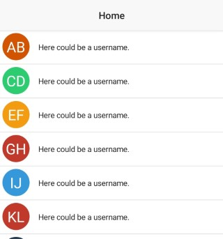

# @schoolsquirrel/letter-avatar

[](https://github.com/@SchoolSquirrel/nativescript-plugins/actions) [](https://github.com/@SchoolSquirrel/nativescript-plugins/blob/master/LICENSE) [](https://github.com/@SchoolSquirrel/nativescript-plugins/graphs/commit-activity)

With this plugin you can create beautiful looking letter avatars in your nativescript app!



## Limitation

This plugin only supports NativeScript 7 or higher. In case you need to use an older NativeScript version, have a look at this [archived repository](https://github.com/hrueger/nativescript-letter-avatar).

## Installation

Install the plugin from using `ns plugin add @schoolsquirrel/letter-avatar`.


## Usage 
### NativeScript Core:
Define the namespace
```xml
<Page class="page"
    loaded="pageLoaded"
    navigatingTo="onNavigatingTo" 
    xmlns="http://schemas.nativescript.org/tns.xsd"
    xmlns:ns="@schoolsquirrel/letter-avatar">
```
Use the plugin:
```xml
<ns:LetterAvatar id="myAvatar" text="AB"></ns:LetterAvatar>
```

You can also add custom styles:
```html
<ns:LetterAvatar color="blue" padding="5" borderRadius="7" id="myAvatar" text="AB"></ns:LetterAvatar> 
```

> Unfortunately, CSS properties are not supported.

For more info and examples check out the demo folder.

### Angular Version:

In your `app.module.ts` include the library like so:
```typescript
import { LetterAvatarModule } from "@schoolsquirrel/letter-avatar/angular";
```
and add it to the imports array:
```typescript
@NgModule({
    bootstrap:  [
        ...
    ],
    declarations: [
        ...
    ],
    imports: [
        ...
        LetterAvatarModule, // <--- add this here
    ],
    schemas: [
        ...
    ],
})
export class AppModule { }
```

The use it in your .html file:
```html
<LetterAvatar text="AB"></LetterAvatar>
```

You can add custom styles:
```html
<LetterAvatar color="blue" padding="5" borderRadius="7" text="AB"></LetterAvatar>
```

> Unfortunately, CSS properties are not supported.

For more info and examples check out the [demo](https://github.com/SchoolSquirrel/nativescript-plugins/tree/main/apps/demo/src/plugin-demos) and the [demo-angular](https://github.com/SchoolSquirrel/nativescript-plugins/tree/main/apps/demo-angular/src/plugin-demos) folder.


## License

MIT
